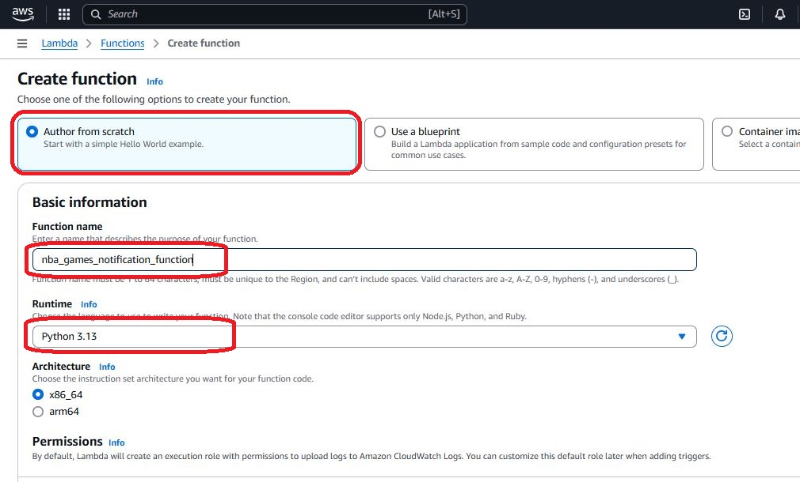

# NBA Game Day Notifications System

This is a real-time notification system that delivers live NBA game scores and updates directly to your phone or email using AWS services.

This scenario can be also useful in cases where periodic notifications are required by say customers, a management, stockbrokers, subscribers to a mailing list, Data Analyst ad it goes on and on.

The system leverages AWS Lambda,AWS SNS, and AWS EventBridge to provide reliable, scalable game-day alerts powered by the SportsData.io API.

## 🏀 Features

* Real-time NBA game score updates via SMS/Email.
* Live quarter and time remaining information.
* Automatic game status monitoring.
* Serverless architecture with AWS Lambda.
* Secure IAM role configurations.
* Scheduled updates using EventBridge.

## 🏀Prerequisites

* AWS Account with appropriate permissions
* SportsData.io API key
* Python 3.x

## 🏀Technology Stack

* Cloud Provider: AWS
* Core Services:
* AWS Lambda (serverless computing)
* Amazon SNS (notifications)
* Amazon EventBridge (scheduling)
* Programming Language: Python 3.x
* External API: SportsData.io NBA API
* IAM Security: Least privilege for Lambda, SNS, and EventBridge.

## 🏀 Project Structure

```bash
Game_day_notification/
├── src/
│   └── game_notification.py                            # Main Lambda function
├── policies/
│   ├── game_notification_policy.json                   # SNS publishing permissions
│   ├── game_notification_eventbridge_policy.json       # EventBridge permissions
│   └── game_notification_lambda_policy.json            # Lambda execution permissions
├── .gitignore
└── README.md
```

## 🏀 Installation & Setup

### Create an account with sportdata.io to enable you have an API key


### Clone the Repository

```bash
Copygit clone [your-repository-url]
cd Games_day_notification
```

### Set Up AWS SNS

* Open the AWS console
* Navigate to the Simple Notification service.
  
* Select Create Topic, choose Standard
  

  

* Give a name to the topic.
* Click Create Topic

### Create a Subscription to the Topic

* Navigate to the subscriptoin tab and create subscription.
  
* select a protocol
  * For Email:
    * Choose Email.
    * Enter a valid email address.
  * For SMS (phone number):
    * Choose SMS.
    * Enter a valid phone number in international format (e.g., +1234567890).
      
* Create Subscription
* Confirm the subscription by clicking the confirmation link in the email.
  
  
  

### Configure IAM Roles

* Create the SNS Publish Policy

  * Open the IAM service in the AWS Management Console.
  * Navigate to Policies → Create Policy.
  * Click JSON and paste the JSON policy from game_notification_policy.json file
  * Replace REGION and ACCOUNT_ID with your AWS region and account ID.
  
  * Click Next: Tags (you can skip adding tags).
  * Click Next: Review.
  * Enter a name for the policy (e.g., game_notification_policy).
  
  * Review and click Create Policy.

* Create an IAM Role for Lambda
  * Open the IAM service in the AWS Management Console.
  * Click Roles → Create Role.
  * Select AWS Service and choose Lambda.
  * Attach the following policies:
    * SNS Publish Policy (gd_sns_policy) (created in the previous step).
    * Lambda Basic Execution Role (AWSLambdaBasicExecutionRole) (an AWS managed policy).
  * Click Next: Tags (you can skip adding tags).
  * Click Next: Review.
  * Enter a name for the role.
  
  * Review and click Create Role.
  

### Deploy the Lambda Function

* Open the AWS Management Console and navigate to the Lambda service.
* Click Create Function.
  
* Select Author from Scratch.
* Enter a function name (e.g., gd_notifications).
* Choose Python 3.x as the runtime.
  
* Assign the IAM role created earlier to the function.
  
* Click create function to complete the process.
* Under the Function Code section:
  * Copy the content of the source/nba_games_notifications.py file from the repository.
  * Paste it into the inline code editor.
    
  * make sure to click the deploy button to deploy your code.
    
* Under the Environment Variables section, add the following:

  ```bash
  SPORTS_DATA_API_KEY: enter your sportsdata.io API key.
  SNS_TOPIC_ARN: enter the ARN of the SNS topic 
  ```

* Go to Test, Create a new event by giving an event name.
  
* save
* run the test event to simulate execution.
* Check CloudWatch Logs for errors.

  

### Set Up Automation with Eventbridge

* Navigate to the Eventbridge service in the AWS Management Console.
  

* Go to Rules → Create a Rule.
  
* Select Event Source: Schedule.
  
* Set the cron schedule for when you want updates (e.g., hourly).
  
* Under Targets, select the Lambda function (gd_notifications) and save the rule.
  
* invoke your AWS Lambda function
  
  
* email NBA Games notification received @ 1:00am
  
